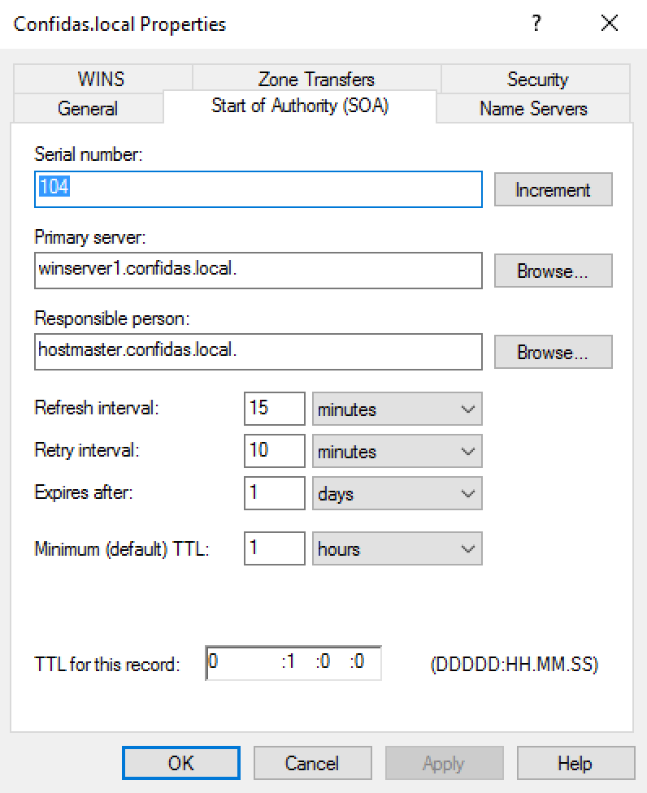
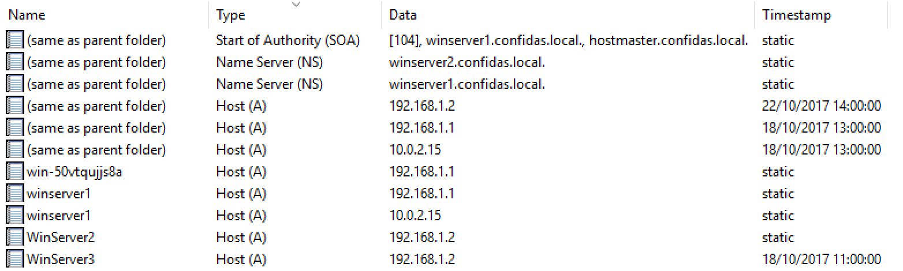

# Oefening 3: Domain Name Server

## Korte omschrijving

Bij deze oefening configureren we de DNS server op WinServer1. Configureren van DNS na installatie van een Active Directory. Hierbij doen we de nodige basisconfiguratie, zoals de configuratie van de A-records en toevoeging van Remote Access. 

## Stappenplan

1. Zone eigenschappen
2. Aanmaken van een Reverse Lookup Zone
3. Configureren van WinServer1 als Router voor het netwerk

## Procedure per stap

### 1. Zone eigenschappen

#### Stel op DC WinServer1 replicatie van de forward lookup zone confidas.local in op To All Domain Controllers in This Domain

DNS MMC > WinServer1.Confidas.local > Forward Lookup Zones > Confidas.local rechterklik > Properties > Replication > Change... > "To All Domain Controllers in This Domain" 

#### Controleer of de AD-replicatie deze wijzigingen ook op DC WinServer2 heeft doorgevoerd

Jap.

#### Bekijk en documenteer het SOA-record van de forward lookup zone confidas.local

#### Bekijk en documenteer het NS-record van de forward lookup zone confidas.local

#### Bekijk en documenteer het A-record van de forward lookup zone confidas.local

### 2. Aanmaken van een Reverse Lookup Zone

DNS MMC > Reverse Lookup Zone rechterklik > New Zone... 

- Primary Zone 
- Store in AD aanvinken 
- To all DCs in this domain 
- IPV4
- Network ID: 192.168.1
- Allow only secure dynamic updates

#### Zorg dat voor de A-records van de machines WinServer1 en WinServer2 ook de bijhorende PTR records worden geschreven

Rechterklik de nieuwe zone > New Pointer (PTR)... > Host Name: Browse...

- Look in: WinServer1 > Forward Lookup Zones > Confidas.local selecteren met 
- Records: WinServer1 selecteren > OK > OK
- Record Types: Hosts (A or AAAA Records)

Dan nog eens nieuwe pointer toevoegen voor de records van WinServer2.

#### Bekijk en documenteer op WinServer1 het PTR-record WinServer2 

Rechterklik de PTR > Properties. Niets interessants te zien. 

#### Bekijk op DC WinServer2 of DNS fouttolerant is in uw netwerk

DNS tool > WinServer1 rechterklik > Properties > Monitoring > Test now (beiden aanvinken)

- Simply query: Pass
- Recursive query: Fail

[DNS recursive test query failed](https://www.experts-exchange.com/questions/21226699/DNS-recursive-test-query-failed.html)

Dan ook de Default Gateway van WinServer2 ingesteld op 192.168.1.1 maar nog steeds fail. 

### 3. Configureren van WinServer1 als Router voor het netwerk [VIDEO](https://www.youtube.com/watch?v=Bb1kNPdjPMs&list=PLIcMo6WmQg3L4TnJf_nudcv5FPepBYwbl&index=2)

#### Test of u op WinServer2 verbinding kan maken met het internet

Geen verbinding voor het toevoegen van de rol.

Na het configureren van de rol, heb ik succesvol internet op WinServer2.

> Maak van DC WinServer1 een NAT router die de NIC Internetconnectie gebruikt voor de verbinding met het internet. 
> Installeer hiervoor de rol Remote Access en ga akkoord met de bijkomende features. 
> Selecteer daarna de rol service Direct Access and VPN (RAS). 
> Configureer nadien de server WinServer2 op een dusdanige manier dat hij via PFSV1 op het internet kan.

#### Rol toevoegen Remote Access 

Add Roles and Features > Next > Role-based > WinServer1 > Remote Access aanvinken > Standaard Features behouden > Next > DirectAccess and VPN (RAS) en ook Routing aanvinken en Add Features. > Next > Standaard Role Services behouden > Restart Automatically en Install. 

#### Routing and Remote Access configureren

Routing and Remote Access MMC > rechterklik WINSERVER1 > Configure routing and remote access... 

Network Address Translation (NAT) selecteren > kies Internet adapter > Finish

## Zaken aangehaald in de les 18/10

Lokaal administrator wordt naar domain administrator gemaakt. 

DNS server > DNS tool > WinServer1 rechterklik > New Zone... met ip 192.168.1 > WinServer1 rechterklik > All Tasks > Reload

Group Policy Management > Forest > Domain > Confidas.local > Group Policy Objects > Default Domain Policies rechterklik > Edit...

DNS tool > WinServer1 rechterklik > Properties > Monitoring > Test now (beiden aanvinken). Properties > Forwarders (moeten servers van hogent of thuis van provider staan)

## Waar had ik problemen mee?

- Bij het configureren van de routing and remote access toonde hij de beschikbare netwerkadapters niet. 

Hiervoor moest ik nog op het vlaggetje in de Server Manager klikken en Configure DirectAccess and VPN (RAS) uitvoeren. Na dit waren de adapters wel beschikbaar in de installatie wizard. 

## Extra bronnen

- Windows Server 2016 manual -> hoofdstuk "Configure DNS Server Fully Step by Step" (pdf bladzijden 116 tem. 135).

- [How to setup Reverse DNS and PTR records](https://www.itworld.com/article/2833006/networking/how-to-setup-reverse-dns-and-ptr-records.html)
